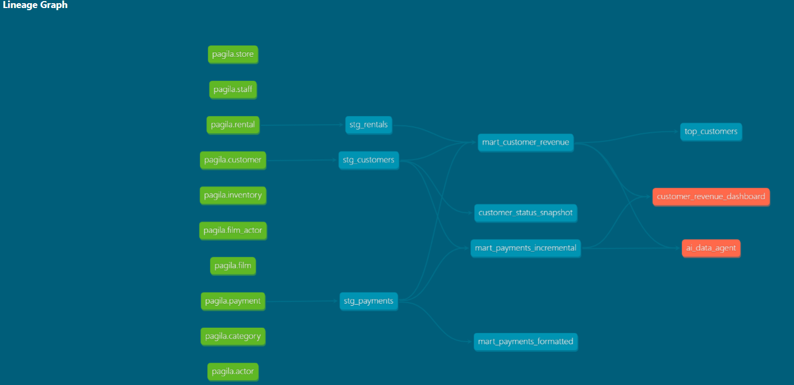

# dbt Pagila Analytics

Practice dbt project using the [Pagila](https://github.com/devrimgunduz/pagila) 
PostgreSQL sample database (film rental data).

## What this project demonstrates
- Layered data modeling: staging → marts
- Source definitions and `ref()` dependencies
- Materialization strategies: view, table, incremental
- Data quality tests (unique, not_null)
- Lineage graph documentation

## Stack
- dbt-core 1.12 + dbt-postgres
- PostgreSQL 16

## Project structure

```
models/
├── staging/              # Clean and rename raw source tables
│   ├── stg_customers.sql
│   ├── stg_payments.sql
│   ├── stg_rentals.sql
│   ├── sources.yml
│   └── schema.yml
└── marts/                # Aggregated models for analytics
    ├── mart_customer_revenue.sql
    ├── mart_payments_incremental.sql
    └── schema.yml
```

## Models
| Model | Layer | Materialization | Description |
|-------|-------|-----------------|-------------|
| stg_customers | staging | view | Cleaned customer data |
| stg_payments | staging | view | Cleaned payment data |
| stg_rentals | staging | view | Cleaned rental data |
| mart_customer_revenue | marts | table | Revenue and rental count per customer |
| mart_payments_incremental | marts | incremental | Payment history, loads only new rows |

## Lineage Graph



Full data lineage from raw sources → staging → marts → exposures (Power BI dashboard, AI agent).
